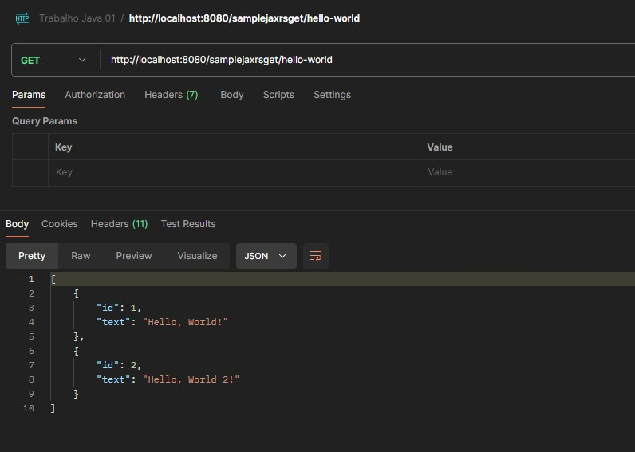

# Sample JAX-RS CRUD

Este é um projeto simples que demonstra o uso do JAX-RS (Java API for RESTful Web Services) para criar um serviço web RESTful em Java. O projeto foi criado usando Maven e é executado no Apache TomEE.

## Arquivos e Pacotes

### Arquivos:

- `src/main/java/com/lucasangelo/ApplicationConfig.java`: Este é o arquivo de configuração principal do aplicativo. Ele define o caminho da aplicação como "/".
- `src/test/java/com/lucasangelo/controller/MessageControllerTest.java`: Este arquivo contém os testes unitários para o controlador de mensagens.
- `src/test/java/com/lucasangelo/service/MessageServiceTest.java`: Este arquivo contém os testes unitários para o serviço de mensagens.
- `pom.xml`: Este é o arquivo de configuração do Maven. Ele contém todas as dependências do projeto e configurações de compilação.

### Pacotes:

- `controller`: Este é geralmente o ponto de entrada para as solicitações HTTP. O controlador manipula a solicitação do usuário e retorna uma resposta. Em um projeto JAX-RS, você pode ter um arquivo como `MessageController.java` no pacote `com.lucasangelo.controller`. Este arquivo pode conter métodos anotados com `@GET`, `@POST`, etc., para lidar com diferentes tipos de solicitações HTTP.
- `service`: Este é o local onde a lógica de negócios é geralmente implementada. Em um projeto JAX-RS, você pode ter um arquivo como `MessageService.java` no `pacote com.lucasangelo.service`. Este arquivo pode conter métodos para lidar com operações de negócios, como buscar, criar, atualizar e excluir mensagens.
- `model` (fake neste projeto): Este é geralmente um objeto de dados que representa a estrutura dos dados que seu aplicativo está manipulando. Em um projeto JAX-RS, você pode ter um arquivo como `Message.java` no `pacote com.lucasangelo.model`. Este arquivo pode conter campos para representar diferentes propriedades de uma mensagem, como id, content, etc., junto com os métodos getter e setter correspondentes.

---

# Requisitos

- Java 8 ou superior
- Maven 3.6.3 ou superior
- Apache TomEE 8.0.6 ou superior (instalado pelo Maven ao executar o comando mvn tomee:run)
- Postman ou outra ferramenta de teste de API (opcional)

---

## Como rodar

- Clone o repositório para a sua máquina local.
- Navegue até o diretório do projeto.
- Execute o comando mvn clean install para compilar o projeto e instalar as dependências.
- Execute o comando mvn tomee:run para iniciar o servidor TomEE e implantar o aplicativo.

### Scripts prontos:

- Iniciar aplicação: `bash run_project.bash`
- Executar testes da aplicação: `bash test_project.bash`

### Rodar com Docker:

- Construir imagem: `docker build -t sample-jaxrs-crud .`
- Rodar container: `docker run -p 8080:8080 sample-jaxrs-crud`

### Rodar com Docker-compose:

- Rodar container: `docker-compose up`
- Parar container: `docker-compose down`
- Accessar a API: `http://localhost:8080/samplejaxrscrud/hello-world`
- Accessar o webapp: `http://localhost:80`

---

## Testando a API

Você pode testar a API usando o Postman ou qualquer outra ferramenta de teste de API.

#### Postman:

O arquivo SAMPLE-JAX-RS-CRUD.postman_collection.json é uma coleção do postman com todos os verbos do endpoint disponiveis (GET, POST, PUT, DELETE).
Importe esse arquivo no Postman e execute as requisições.

---

## Licença

Este projeto está licenciado sob a licença MIT.
